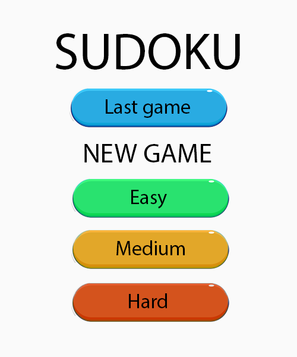
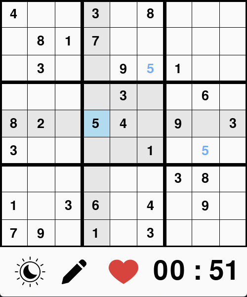
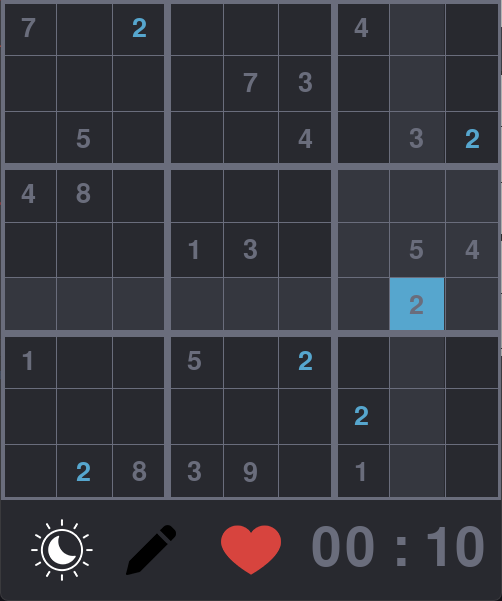

# Sudoku

[PL](#pl)

[ENG](#eng)

## PL
   ### Opis projektu
   Projekt skupia się na stworzeniu gry Sudoku w pygamie. Sudoku to logiczna łamigłówka numeryczna, której celem jest wypełnienie planszy 9x9 cyframi od 1 do 9 w taki sposób, aby w każdym rzędzie, kolumnie i 3x3 podkwadracie nie powtarzały się żadne cyfry.
   Gracz na moliwość wyboru poziomu trudności - łatwego, średniego lub trudnego. Plansze są generowane z wykorzystaniem zewnętrznego API, zapewniając różnorodność rozrywki. Gra jest przewidziana dla 1 osoby.
   
   ### Funkcje
   - Trzy poziomy trudności: Łatwy, Średni i Trudny
   - Dynamiczny interfejs użytkownika z motywem jasnym i ciemnym
   - Tryb ołówka do robienia notatek
   - Śledzenie wyników i wyświetlanie najwyższego wyniku
   - Możliwośc zapisu gry i kontynuowania w późniejszym czasie
   
   ### Zasady gry:
   
   1. Standardowa plansza Sudoku składa się z siatki 9x9 podzielonej na 3x3 bloki. Każdy blok jest również podzielony na 3x3 pola.
   2. Gracz wypełnia planszę cyframi od 1 do 9. Każda cyfra może pojawić się tylko raz w każdym rzędzie, kolumnie i bloku 3x3.
   3. Gra zaczyna się od wstępnie wypełnionej siatki, gdzie niektóre pola są już uzupełnione cyframi.
   4. Każde pole na planszy może zawierać tylko jedną cyfrę. Zadanie gracza polega na uzupełnieniu całej planszy.

   ### Wymagania
   - Python 3
   - Biblioteki:
      - Pygame
      - Pandas
      - Requests

   ### Użycie
   - Uruchom program main.py
   - Wybierz poziom trudności

   ### Sterowanie
   - Poruszaj sie po komórkach za pomocą kliknięć myszy
   - Naciśnij klawisze numeryczne(1-9), aby wprowadzić wartości
   - Aktywuj/dezaktywuj tryb ołówka, klikając przycisk ołówka

   ### Autor
   - Jakub Pawiński

   ### Zdjęcia z gry
   
   
    

   

    

   

## ENG

   ### Project Description

   The project focuses on creating a Sudoku game in Pygame. Sudoku is a numerical logic puzzle game where the goal is to fill a 9x9 grid with numbers from 1 to 9 in such a way that no numbers repeat in any row, column, or 3x3 subgrid. Players have the option to choose the difficulty level - easy, medium, or hard. The boards are generated using an external API to provide gameplay variety. The game is designed for single-player use.

   ### Features
   - Three difficulty levels: Easy, Medium, and Hard
   - Dynamic user interface with light and dark themes
   - Pencil mode for note-taking
   - Score tracking and high score display
   - Save and continue the last game

   ### Game Rules:
   1. The standard Sudoku board consists of a 9x9 grid divided into 3x3 blocks. Each block is further divided into 3x3 fields.
   2. The player fills the board with numbers from 1 to 9. Each number can only appear once in each row, column, and 3x3 block.
   3. The game starts with a partially filled grid, where some fields already have numbers.
   4. Each field on the board can only contain one digit. The player's task is to fill the entire board.

   ### Requirements

   - Python 3
   - Libraries:
      - Pygame
      - Pandas
      - Requests

   ### Usage
   - Run the main.py program.
   - Choose the difficulty level.

   ### Controls
   - Navigate through cells using mouse clicks.
   - Press the numeric keys (1-9) to input values.
   - Activate/deactivate pencil mode by clicking the pencil button.

   ### Author
   - Jakub Pawiński

   ### Screenshots

   
   
    

   

    

   
